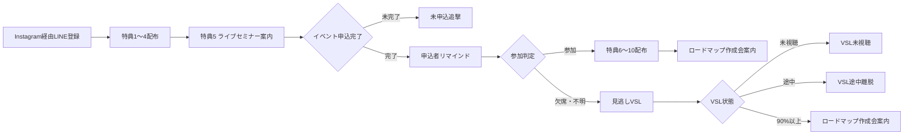

# Instagram 10大特典ファネル UTAGE実装・監査指示書

## 1. 案件情報

- 流入元: Instagram
- 目的: 特典配布 → ライブセミナー → 見逃しVSL → `AIひとり起業ロードマップ作成会`
- 最終CV: `AIひとり起業スクール` 成約
- UTAGE配信アカウント: `66ET2JNrdHub`
- ステータス: 実機監査済み・後半導線の接続待ち
- 最終更新日: 2026-08-02

## 2. 正しい全体フロー

YouTube用のZoom活用サポート会は作りません。

## 3. 実機監査結果

| 項目 | 現在値 | 判定 |
|---|---|---|
| 登録直後 | `yJmSFG2efpDL` / 3通 / 稼働中 | 特典①〜④とセミナー案内あり |
| セミナー未申込 | `LGY0cMN82rqq` / 18通 / 稼働中 | 停止条件を補強済み |
| 申込ページクリック・未申込 | `hSBYOxL1fC7r` / 10通 / 下書き | 誤アクション解除済み・正しい入口アクション未接続 |
| 申込者LINE | `ygT4wXC7zJah` / 9通 / 稼働中 | 読者2人 |
| 旧申込者リマインダ | `jkgFPq78MtRK` / 7通 / 稼働中 | 新旧重複候補。読者1人 |
| 参加者特典 | `HHbjLEfv9iIo` / 1通 / 下書き | 参加判定アクション未接続 |
| VSL未視聴 | `KXlnmXtfBXYc` / 5通 / 下書き | 登録日起算・読者別期限。LINE計測リンク経由のテスト待ち |
| VSL途中離脱 | `H58UZOKeS4UW` / 5通 / 下書き | 動画79分地点の完了アクションが未設定 |
| VSL90%以上 | `8kRDb7qWDEYr` / 6通 / 下書き | 面談URLは有効 |
| 個別面談リマインダ | `20lJAcFLCNit` / 7通 / 稼働中 | 読者0人 |

### 確認済みURL

- セミナー申込: `https://utage-system.com/event/AlKrSxXMyzNt/register`（200）
- Instagram用VSL: `https://utage-system.com/p/noc7btpfUP1q`（読者文脈なしの直アクセスは設定どおり404）
- ロードマップ作成会: `https://utage-system.com/event/bi5FCdSPf6ju/register`（200）

## 4. 監査時に補修したもの

次のラベルを追加しました。

| ラベル | 用途 |
|---|---|
| `src_instagram_10benefits` | Instagram 10大特典の流入保存 |
| `seminar_main_page_clicked` | セミナー申込ページ到達。申込完了とは別 |
| `sales_in_progress` | 商談中 |
| `sales_next_meeting` | 次回面談あり |
| `sales_no_next_meeting` | 次回面談なし |
| `sales_won` | 成約 |
| `sales_stop` | 営業停止希望 |

以下の50通へ、上位状態・逆流を防ぐ配信条件を追加しました。

- セミナー未申込、申込ページクリック未申込
- セミナー参加者特典、参加者面談案内
- VSL未視聴、途中離脱、90%以上視聴

`sales_in_progress`、`sales_next_meeting`、`sales_won`、`sales_stop` を含む読者には、下位のセミナー・VSL・面談募集を送りません。

## 5. 必ず直すイベント・アクション

### 5.1 申込ページクリック

既存アクション `kpqaWZkjUyD1` は、クリック時点で `seminar_main_registered` を付けていました。誤登録を止めるため、このアクションは次の29通のURLから解除済みです。

- `登録直後`: 1通
- `セミナー未申込者`: 18通
- `申込ページクリック・未申込`: 10通

29通をUTAGEから再取得し、`kpqaWZkjUyD1` が残っていないことを確認済みです。URLそのものは変更していません。

管理画面で `SEMページ閲覧_Instagram` アクションを新設します。`登録直後` 1通と `セミナー未申込者` 18通へだけ接続し、クリック時は次を実行します。

1. `seminar_main_page_clicked`（`H68EUqKlG0lg`）を付与
2. `セミナー未申込者`（`LGY0cMN82rqq`）から解除
3. `セミナー申込ページクリック・未申込`（`hSBYOxL1fC7r`）へ登録
4. `seminar_main_registered` は付与しない

`申込ページクリック・未申込` 内の10通は、再クリックでシナリオを先頭へ戻さないよう、アクションなしのままにします。

### 5.2 イベント申込完了

イベント `AlKrSxXMyzNt` のフォーム送信完了時に、次を実行します。

1. `seminar_main_registered` を付与
2. `セミナー未申込者` と `申込ページクリック・未申込` から解除
3. `セミナー申込者LINEリマインド`（`ygT4wXC7zJah`）へ登録
4. メールを取得できる場合だけ `セミナー申込者メール`（`upP25Og1p4IL`）へ登録

旧 `AIでひとり起業リマインダ`（`jkgFPq78MtRK`）へ同時登録しないでください。

### 5.3 開催後

参加確認できた人:

1. `seminar_main_attended` を付与
2. `seminar_main_absent_unknown` を解除
3. `セミナー参加者・特典配布`（`HHbjLEfv9iIo`）へ登録

欠席または参加確認できない人:

1. `seminar_main_absent_unknown` と `vsl_offered` を付与
2. `VSL未視聴`（`KXlnmXtfBXYc`）へ登録
3. 文面は「見逃した方・復習したい方へ」とし、参加者への誤送信を避ける

## 6. VSLページ

ファネル `w8Gyfweu0qLz`、ステップ `noc7btpfUP1q`、ページ `ju41r0jM7xBd` は存在します。

カウントダウンは `subscribe_absolute`・3日で、読者の登録日時を基準にします。読者文脈を取得できない場合は `unknown_target_action: 404` の設定どおり404へ送られます。したがって、認証情報のないHTTP直接取得が404であることだけを「ページ未公開」の根拠にしません。

実機ページの動画要素には79分地点の `video_actions` がありますが、`message_action_id` が `null` です。本番前にInstagram専用の `VSL完了_Instagram` アクションを作成し、79分地点または完了CTAへ設定します。

また、VSL未視聴5通のボタンは `vsl_page_clicked` だけを直接付与しており、`vsl_partial` の付与と途中離脱シナリオへの登録がありません。`VSL初回クリック_Instagram` アクションを作成し、未視聴5通のVSL URLへ接続します。

### `VSL初回クリック_Instagram`

1. `vsl_page_clicked`（`wxPX0katO0Yb`）を付与
2. `vsl_partial`（`UKwO9DM5tVlT`）を付与
3. `VSL未視聴`（`KXlnmXtfBXYc`）から解除
4. `VSL途中離脱`（`H58UZOKeS4UW`）へ登録

### `VSL完了_Instagram`

1. `vsl_completed`（`xUPl6CZ91cRl`）を付与
2. `VSL未視聴`（`KXlnmXtfBXYc`）と `VSL途中離脱`（`H58UZOKeS4UW`）から解除
3. `VSL90％以上・個別面談`（`8kRDb7qWDEYr`）へ登録

1. UTAGEのLINEテスト読者へ実際の計測リンクを送る
2. 計測リンク経由で `https://utage-system.com/p/noc7btpfUP1q` が表示される
3. ページ到達で `vsl_page_clicked` と `vsl_partial` を付与
4. 79分地点または完了CTAで `vsl_completed` を付与
5. `vsl_completed` 付与時に未視聴・途中離脱を停止し、`VSL90％以上・個別面談` へ登録
6. Meta広告用の `W8wW6ShW0iHd` とMeta用ラベルは使用しない

## 7. 優先順位

1. `sales_won` / `sales_stop`
2. `sales_next_meeting` / `sales_in_progress`
3. `consult_booked` / `consult_completed`
4. `seminar_main_registered`
5. VSL完了・途中・未視聴
6. セミナー未申込

## 8. 公開前テスト

1. 申込ページを開いただけでは `seminar_main_registered` が付かない。
2. フォーム送信後だけ未申込追撃が止まる。
3. 申込者に旧・新リマインドが二重送信されない。
4. 参加者には特典⑥〜⑩が届き、純粋な欠席文面が届かない。
5. 欠席・不明者はVSLへ入り、実際のLINE計測リンク経由でページが表示される。
6. VSLクリックで未視聴が止まり、途中離脱へ移る。
7. VSL完了で未視聴・途中離脱が止まり、作成会案内へ移る。
8. 作成会予約直後に全募集が止まり、予約リマインドだけになる。
9. 商談中・次回面談あり・成約・停止希望には下位配信が届かない。

## 9. 未確定・管理画面作業待ち

- `SEMページ閲覧_Instagram` の作成と、登録直後1通・未申込18通への接続（誤アクションは解除済み）
- イベント申込完了時アクション
- 開催後の参加／欠席振り分け
- `VSL初回クリック_Instagram` と `VSL完了_Instagram` の作成・接続、LINE計測リンク経由テスト
- 旧リマインダ `jkgFPq78MtRK` の停止可否
- 実績、参加人数、残席、期限表現の事実確認

これらは管理画面で実値を確認してから変更し、テスト後に本番化します。
