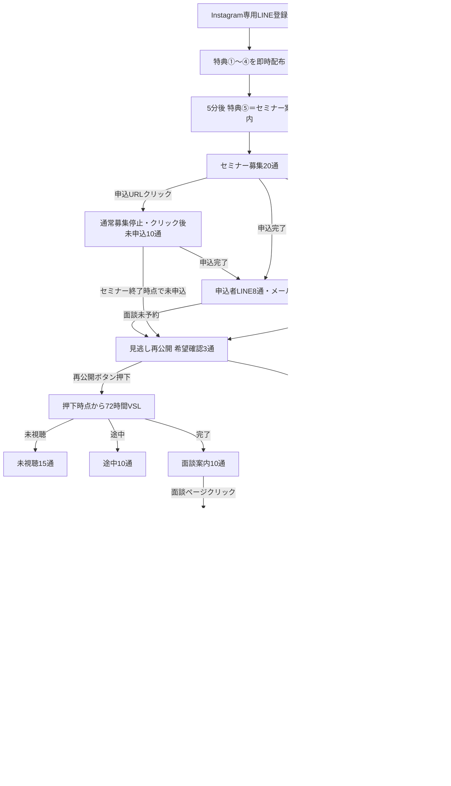

# Instagram 10大特典ファネル UTAGE実装指示書

## 1. 案件情報

- 流入元: Instagram専用の新規LINE登録
- 目的: 特典配布 → ライブセミナー → 希望者限定VSL → 個別面談
- ゴール: 面談完了
- 実装担当者: 金子さん
- ステータス: Spreadsheet承認済み・UTAGE実装待ち
- 最終更新日: 2026-08-07
- 承認済みSpreadsheet: https://docs.google.com/spreadsheets/d/1TGC-Jtf4z2IA1PpL8dK0oyHrh74d2uPkmfGCNQCnxus/edit?gid=32489066
- GitHubフォルダ: https://github.com/puuku0510/suya-ai-school-line-funnel/tree/agent/audit-instagram-meta-funnels/instagram-10-benefits-live-seminar-vsl
- 変更禁止UTAGEアカウント: YouTube `Y86og5tIw1hZ`

承認件数は、アクション19行、メッセージ104行、合計123行です。本文全文、件名、絵文字、画像URL、CTA、配信時刻、付与・解除・除外条件は `instagram-10-benefits-live-seminar-vsl-all-scenarios.csv` を正本としてコピーしてください。

## 2. 正本と変更禁止事項

優先順位:

1. 承認済みSpreadsheet `REVIEW_Instagram10大特典_20260805`
2. 本指示書の状態遷移、停止条件、実装順
3. 承認済み123行CSV
4. UTAGE本番のID、URL、イベント、置換文字の実値

禁止:

- YouTube、Meta広告の本番オブジェクトを変更すること
- 吉本さん原案または承認済みYouTube補完文以外のオリジナル文章を追加すること
- 本文、件名、絵文字、画像、CTA、順番、配信時刻を独自に変えること
- 特典①〜④のリンククリック有無を判定すること
- 旧BEN-C／BEN-Nの「特典クリック済み・未クリック」を作成・稼働させること
- セミナー参加／欠席をVSL入口条件にすること
- 再公開ボタン未押下者へVSLを送ること
- 特典⑥〜⑩をLINEで配布すること
- 原案画像13枚を加工、再生成、画像内文言変更すること

YouTube本番UTAGEでは申込者向けメール `REG-M04` からVSLを直接送る既存設定を確認しています。ただし、承認済みInstagramは希望確認3通を経由します。この差分は意図的であり、どちらも独自変更しません。

## 3. 承認済み全体フロー

## 4. 必須状態と優先順位

実際のラベルID・アクションIDはUTAGEから取得し、推測で作らないでください。既存名がある場合は重複作成せず、媒体がInstagram専用であることを確認します。

| 優先 | 状態 | 必須の挙動 |
|---:|---|---|
| 1 | `sales_won` / `sales_stop` | すべての下位配信を停止 |
| 2 | `meeting_completed` | 面談をゴールとし、自動配信対象外 |
| 3 | `sales_in_progress` / `sales_next_meeting` | 募集、VSL、オプチャを停止 |
| 4 | `roadmap_booked` | 面談催促と他オファーを停止、予約リマインドだけ許可 |
| 5 | `offer_consult_48h_active` | VSL期限、オプチャ、他オファーを停止 |
| 6 | `vsl_main_completed` | 未視聴・途中を停止、完了向けだけ許可 |
| 7 | `vsl_main_started` | 未視聴を停止、途中向けだけ許可 |
| 8 | `vsl_replay_requested` | 押下時点から72時間VSLを許可 |
| 9 | `seminar_main_registered` | 未申込系を停止、申込者リマインドだけ許可 |
| 10 | `seminar_main_page_clicked` | 通常募集を停止、クリック後未申込だけ許可 |
| 11 | `ig_benefit_1to4_delivered` | 特典クリック判定なしでセミナー案内へ進む |

推奨補助状態:

- `src_instagram_10benefits`
- `offer_seminar_active`
- `offer_vsl_confirmation_active`
- `offer_vsl_active`
- `offer_noshow_rebook_active`
- `openchat_link_clicked`

## 5. CSV行とUTAGEシナリオの対応

| No. | 種別 | 内容 | 件数 |
|---:|---|---|---:|
| 1〜19 | アクション | 入口・状態遷移・競合停止 | 19 |
| 20〜21 | メッセージ | 入口・特典 | 2 |
| 22〜41 | メッセージ | セミナー募集 | 20 |
| 42〜51 | メッセージ | セミナーページクリック後未申込 | 10 |
| 52〜59 | メッセージ | セミナー申込者LINE | 8 |
| 60〜65 | メッセージ | セミナー申込者メール | 6 |
| 66〜68 | メッセージ | 見逃し再公開 希望確認 | 3 |
| 69〜83 | メッセージ | VSL未視聴 | 15 |
| 84〜93 | メッセージ | VSL途中 | 10 |
| 94〜103 | メッセージ | VSL完了・面談案内 | 10 |
| 104〜113 | メッセージ | 面談ページクリック後48時間催促 | 10 |
| 114〜118 | メッセージ | 面談予約後リマインド | 5 |
| 119〜121 | メッセージ | 面談無断欠席・再予約 | 3 |
| 122〜123 | メッセージ | オープンチャット | 2 |

## 6. イベント別の停止・登録動作

### 6.1 新規LINE登録

1. Instagram流入を保存する。
2. 特典①〜④を即時配布し、受取済み扱いにする。
3. 特典クリック有無を待たず、5分後に特典⑤＝セミナー案内を送る。
4. 他媒体の入口・既存オファーへ同時登録しない。

### 6.2 セミナーURLクリック

1. 通常のセミナー募集20通を停止する。
2. クリックは申込完了扱いにしない。
3. ページクリック後未申込10通へ登録する。

### 6.3 セミナー申込完了

1. 通常募集とページクリック後未申込をすべて停止する。
2. 申込者LINE8通へ登録する。
3. メール取得時だけ申込者メール6通へ登録する。
4. 開催済みの相対時刻メッセージを遡及送信しない。

### 6.4 セミナー終了後

1. 未申込者と申込済み・面談未予約者を希望確認3通へ登録する。
2. 参加／欠席は入口判定に使わない。
3. 再公開ボタン押下者だけ、押下時点から72時間VSLへ登録する。
4. 未押下者へVSLを送らず、承認済み時刻にオプチャへ移す。

### 6.5 VSL状態変化

1. 視聴開始時に未視聴15通を停止し、途中10通へ移す。
2. 視聴完了時に未視聴・途中を停止し、面談案内10通へ移す。
3. 72時間満了時にVSLを閉じ、面談ページクリック済みでなければ承認済みの次状態へ移す。

### 6.6 面談ページクリック

1. VSL完了向け、VSL期限、オプチャ移行、競合オファーを即停止する。
2. クリック時刻を保存し、そこから厳密に48時間だけ面談催促10通を許可する。
3. 48時間内の予約で催促を即停止し、予約後リマインド5通へ移す。
4. 48時間未予約なら面談受付をクローズし、オプチャ2通へ移す。

### 6.7 面談予約・無断欠席・完了

1. 予約後は予約完了、前日、当日、3時間前、30分前の5通だけを送る。
2. キャンセル・日程変更時は旧予約に紐づくリマインドを止める。
3. 無断欠席は再予約案内3通を送り、再予約がなければオプチャ2通へ移す。
4. 面談完了をゴールとし、システム自動のオプチャを含む全配信を止める。

### 6.8 オプチャリンククリック

1. クリック状態を保存する。
2. 残りのオプチャ配信を停止する。

## 7. 置換文字・実値

次の値は本番変更前にUTAGEから取得し、CSVのプレースホルダーを置換してください。

- `[お名前]`
- `[セミナー名]`
- `[開催日]` `[開始時刻]` `[終了時刻]`
- `[セミナー申込URL]` `[ZoomURL]`
- `[VSL再公開希望URL]` `[VSLURL]` `[VSL期限日時]`
- `[面談ページURL]` `[面談受付終了日時]`
- `[予約日時]` `[予約変更URL]` `[キャンセルURL]`
- `[オプチャURL]`

VSL期限は再公開ボタン押下時刻、面談受付終了は面談ページクリック時刻を基準に生成します。固定日付や登録日起算で代用しません。

## 8. 実装順

1. 対象アカウント、登録経路、イベント、シナリオ、ラベル、アクション、URLを読み取り監査する。
2. 既存オブジェクトを「変更しない・更新・新規作成」に分類する。
3. バックアップとロールバック手順を記録する。
4. ラベルと停止アクションを先に作る。
5. 上位状態から下位状態への除外条件を設定する。
6. 入口、セミナー、希望確認、VSL、面談、無断欠席、オプチャの順で構築する。
7. CSV本文と画像13枚を一字・一枚単位で照合する。
8. テスト読者だけで全経路を通し、本番読者への影響がないことを確認する。
9. 人間の承認後に公開し、公開後も実機から設定を再取得して差分がないことを確認する。

## 9. 公開前テスト

1. 新規登録直後に特典①〜④が届き、5分後に特典⑤が届く。
2. 特典リンクを開かなくても同じ流れになり、BEN-C／BEN-Nへ入らない。
3. セミナーURLクリックで通常募集が止まり、申込完了とは判定されない。
4. 申込完了で未申込系がすべて止まり、LINE8通・メール6通だけに入る。
5. 7日前、3日前を含む相対配信が過去分を遡及送信しない。
6. セミナー終了後、対象者に希望確認が正確に3通届く。
7. 参加／欠席に関係なく、再公開ボタン押下者だけ72時間VSLへ入る。
8. 未押下者へVSLが届かない。
9. VSL開始で未視聴15通、完了で未視聴・途中10通が止まる。
10. VSL完了後は面談案内10通だけに入る。
11. 面談ページクリックでVSL期限とオプチャ移行が止まり、48時間催促10通だけに入る。
12. 48時間の起算と受付クローズがクリック時刻から厳密に動く。
13. 面談予約で催促が止まり、予約後5通だけが届く。
14. 無断欠席時は再予約3通、その後未再予約ならオプチャ2通へ移る。
15. 面談完了者へオプチャを含む自動配信が届かない。
16. オプチャリンククリックで残りのオプチャ配信が止まる。
17. 他オファーの割り込みと二重配信がない。
18. 本文、絵文字、CTA、時刻がCSVと一致し、独自文章がない。
19. 吉本さん原案画像13枚が加工なしで対応行に設定される。
20. YouTube本番の更新履歴に本案件由来の変更がない。

## 10. 実装者への最終注意

- 実値が不明なまま推測で保存しないでください。
- 矛盾を発見したら本番変更を止め、Spreadsheet、CSV、実装指示書、UTAGE実機の差分を報告してください。
- 本文を変える必要があると思っても独自修正せず、対象行と理由を提示して承認を得てください。
- 本番変更前の承認と、公開後の実機再取得による証跡を残してください。
