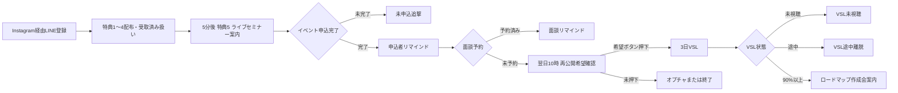

# Instagram 10大特典ファネル UTAGE実装・監査指示書

## 1. 案件情報

- 流入元: Instagram
- 目的: 特典配布 → ライブセミナー → 見逃しVSL → `AIひとり起業ロードマップ作成会`
- 最終CV: `AIひとり起業スクール` 成約
- UTAGE配信アカウント: `66ET2JNrdHub`
- ステータス: 2026-08-02実機監査スナップショット／2026-08-06クリック判定廃止をUTAGEへ手動反映待ち
- 最終更新日: 2026-08-06

### 2026-08-06の優先修正

- Instagram専用LINE登録と特典①〜④の配布完了をもって受取済みとする。
- 特典リンクのクリック有無は計測・分岐条件にしない。
- 旧 `cqntavqgASCi`「特典反応別・セミナー予告（新／下書き）」の BEN-C01 / BEN-N01 / BEN-C02 は停止し、実装しない。
- 特典①〜④の配布完了から5分後に、全員へ特典⑤＝セミナー案内を送る。
- 本文は吉本さん原案を維持し、この構造修正を理由に独自リライトしない。

## 2. 正しい全体フロー

YouTube用のZoom活用サポート会は作りません。参加者の特典⑥〜⑩はセミナー中QRで受け取らせ、LINEで再配布しません。参加／欠席はVSL入口条件にしません。

特典①〜④のリンクを開いたかどうかで、BとCの間を分岐させません。

## 3. 2026-08-02実機監査結果（履歴）

この章以降にある参加／欠席分岐の記録は当時の実機スナップショットであり、現行仕様として再実装しない。現行は、セミナー申込済み・面談未予約者へ翌日10:00に再公開希望を確認し、希望ボタン押下者だけVSLへ入れる。

| 項目 | 現在値 | 判定 |
|---|---|---|
| 登録直後 | `yJmSFG2efpDL` / 3通 / 稼働中 | 特典①〜④とセミナー案内あり |
| セミナー未申込 | `LGY0cMN82rqq` / 18通 / 稼働中 | 停止条件を補強済み |
| 申込ページクリック・未申込 | `hSBYOxL1fC7r` / 10通 / 下書き | 正しい入口アクションを接続済み |
| 申込者LINE | `ygT4wXC7zJah` | 申込直後2件稼働、旧ステップ8件下書き、イベント基準8件と開催後2アクション稼働 |
| 旧申込者リマインダ | `jkgFPq78MtRK` / 7通 / 稼働中 | イベント `AlKrSxXMyzNt` の登録先から解除。既存読者1人のみ残存 |
| 参加者特典 | `HHbjLEfv9iIo` / 1通 / 下書き | 開催後参加アクションから接続済み。公開前テスト待ち |
| VSL未視聴 | `KXlnmXtfBXYc` / 5通 / 下書き | 開催後欠席アクションから接続済み。LINE計測リンク経由のテスト待ち |
| VSL途中離脱 | `H58UZOKeS4UW` / 5通 / 下書き | 初回クリック・動画完了アクションを接続済み |
| VSL90%以上 | `8kRDb7qWDEYr` / 6通 / 下書き | 面談URLは有効 |
| 個別面談リマインダ | `20lJAcFLCNit` / 7通 / 稼働中 | 読者0人 |

### 確認済みURL

- セミナー申込: `https://utage-system.com/event/AlKrSxXMyzNt/register`（200）
- Instagram用VSL: `https://utage-system.com/p/noc7btpfUP1q`（読者文脈なしの直アクセスは設定どおり404）
- ロードマップ作成会: `https://utage-system.com/event/bi5FCdSPf6ju/register`（200）

## 4. 監査時に補修したもの

次のラベルを追加しました。

| ラベル | 用途 |
|---|---|
| `src_instagram_10benefits` | Instagram 10大特典の流入保存 |
| `seminar_main_page_clicked` | セミナー申込ページ到達。申込完了とは別 |
| `sales_in_progress` | 商談中 |
| `sales_next_meeting` | 次回面談あり |
| `sales_no_next_meeting` | 次回面談なし |
| `sales_won` | 成約 |
| `sales_stop` | 営業停止希望 |

以下の50通へ、上位状態・逆流を防ぐ配信条件を追加しました。

- セミナー未申込、申込ページクリック未申込
- セミナー参加者特典、参加者面談案内
- VSL未視聴、途中離脱、90%以上視聴

`sales_in_progress`、`sales_next_meeting`、`sales_won`、`sales_stop` を含む読者には、下位のセミナー・VSL・面談募集を送りません。

## 5. 必ず直すイベント・アクション

### 5.1 申込ページクリック

既存アクション `kpqaWZkjUyD1` は、クリック時点で `seminar_main_registered` を付けていました。誤登録を止めるため、このアクションは次の29通のURLから解除済みです。

- `登録直後`: 1通
- `セミナー未申込者`: 18通
- `申込ページクリック・未申込`: 10通

29通をUTAGEから再取得し、`kpqaWZkjUyD1` が残っていないことを確認済みです。URLそのものは変更していません。

管理画面で `SEMページ閲覧_Instagram`（`x1xPC12gSDjV`）を新設済みです。`登録直後` 1通と `セミナー未申込者` 18通へだけ接続し、クリック時は次を実行します。

1. `seminar_main_page_clicked`（`H68EUqKlG0lg`）を付与
2. `セミナー未申込者`（`LGY0cMN82rqq`）から解除
3. `セミナー申込ページクリック・未申込`（`hSBYOxL1fC7r`）へ登録
4. `seminar_main_registered` は付与しない

`申込ページクリック・未申込` 内の10通は、再クリックでシナリオを先頭へ戻さないよう、アクションなしのままにします。

### 5.2 イベント申込完了

イベント `AlKrSxXMyzNt` のフォーム送信完了時に、`SEM申込完了_Instagram`（`Vr7UecxwCuCl`）を実行するよう接続済みです。

1. `seminar_main_registered` を付与
2. `セミナー未申込者` と `申込ページクリック・未申込` から解除
3. `セミナー申込者LINEリマインド`（`ygT4wXC7zJah`）へ登録
4. メールを取得できる場合だけ `セミナー申込者メール`（`upP25Og1p4IL`）へ登録

旧 `AIでひとり起業リマインダ`（`jkgFPq78MtRK`）へ同時登録しないでください。

### 5.2.1 申込者リマインドの実装値

イベント `AlKrSxXMyzNt` は新シナリオ `ygT4wXC7zJah` を使用します。登録日起算だった旧ステップ8本はすべて下書き化し、次のイベント参加日時基準リマインドへ置換済みです。

| 管理名称 | 送信タイミング | 状態 |
|---|---:|---|
| `REM-REG-L02 D-7 10:00` | 7日前 10:00 | 稼働中 |
| `REM-REG-L03 D-3 10:00` | 3日前 10:00 | 稼働中 |
| `REM-REG-L03b D-2 10:00` | 2日前 10:00 | 稼働中 |
| `REM-REG-L04 D-1 19:00` | 1日前 19:00 | 稼働中 |
| `REM-REG-L05 当日09:00` | 当日 09:00 | 稼働中 |
| `REM-REG-L06 開始3時間前` | 3時間前 | 稼働中 |
| `REM-REG-L07 開始30分前` | 30分前 | 稼働中 |
| `REM-REG-L08 開始時刻` | 当日 21:00 | 稼働中 |

再構築時に、旧ボタン形式のZoom導線は本文を維持した直接URL `https://us06web.zoom.us/j/87999863001` に変更しました。本文には今回の開催日（2026-08-07）が固定文言で含まれるため、別日程へ流用するときはイベント日時・本文日付・Zoom URLを8本まとめて再確認してください。

### 5.3 開催後

開催翌日の自動振り分けを設定済みです。

参加確認できた人（参加済・遅刻）は、イベント参加日の1日後09:00に `SEM参加_Instagram`（`bZo7BGUmu7RA`）を実行します。

1. `seminar_main_attended` を付与
2. `seminar_main_absent_unknown` を解除
3. `セミナー参加者・特典配布`（`HHbjLEfv9iIo`）へ登録

欠席または参加確認できない人（参加予定のまま・無断キャンセル）は、イベント参加日の1日後09:05に `SEM欠席_VSL開始_Instagram`（`aFlVjsaEZLNw`）を実行します。

1. `seminar_main_absent_unknown` と `vsl_offered` を付与
2. `VSL未視聴`（`KXlnmXtfBXYc`）へ登録
3. 文面は「見逃した方・復習したい方へ」とし、参加者への誤送信を避ける

## 6. VSLページ

ファネル `w8Gyfweu0qLz`、ステップ `noc7btpfUP1q`、ページ `ju41r0jM7xBd` は存在します。

カウントダウンは `subscribe_absolute`・3日で、読者の登録日時を基準にします。読者文脈を取得できない場合は `unknown_target_action: 404` の設定どおり404へ送られます。したがって、認証情報のないHTTP直接取得が404であることだけを「ページ未公開」の根拠にしません。

実機ページの動画79分地点は、Instagram専用 `VSL完了_Instagram`（`FR9Hujbs6tzK`）へ接続済みです。誤って参照していたYouTube側LINEアカウントIDも、Instagram側の数値ID `100893` に修正済みです。

VSL未視聴5通のリンクは `VSL初回クリック_Instagram`（`tQSVljUyhIey`）へ接続済みです。

### `VSL初回クリック_Instagram`

1. `vsl_page_clicked`（`wxPX0katO0Yb`）を付与
2. `vsl_partial`（`UKwO9DM5tVlT`）を付与
3. `VSL未視聴`（`KXlnmXtfBXYc`）から解除
4. `VSL途中離脱`（`H58UZOKeS4UW`）へ登録

### `VSL完了_Instagram`

1. `vsl_completed`（`xUPl6CZ91cRl`）を付与
2. `VSL未視聴`（`KXlnmXtfBXYc`）と `VSL途中離脱`（`H58UZOKeS4UW`）から解除
3. `VSL90％以上・個別面談`（`8kRDb7qWDEYr`）へ登録

1. UTAGEのLINEテスト読者へ実際の計測リンクを送る
2. 計測リンク経由で `https://utage-system.com/p/noc7btpfUP1q` が表示される
3. ページ到達で `vsl_page_clicked` と `vsl_partial` を付与
4. 79分地点または完了CTAで `vsl_completed` を付与
5. `vsl_completed` 付与時に未視聴・途中離脱を停止し、`VSL90％以上・個別面談` へ登録
6. Meta広告用の `W8wW6ShW0iHd` とMeta用ラベルは使用しない

## 7. 優先順位

1. `sales_won` / `sales_stop`
2. `sales_next_meeting` / `sales_in_progress`
3. `consult_booked` / `consult_completed`
4. `seminar_main_registered`
5. VSL完了・途中・未視聴
6. セミナー未申込

## 8. 公開前テスト

1. 申込ページを開いただけでは `seminar_main_registered` が付かない。
2. フォーム送信後だけ未申込追撃が止まる。
3. 申込者に旧・新リマインドが二重送信されない。
4. 参加者には特典⑥〜⑩が届き、純粋な欠席文面が届かない。
5. 欠席・不明者はVSLへ入り、実際のLINE計測リンク経由でページが表示される。
6. VSLクリックで未視聴が止まり、途中離脱へ移る。
7. VSL完了で未視聴・途中離脱が止まり、作成会案内へ移る。
8. 作成会予約直後に全募集が止まり、予約リマインドだけになる。
9. 商談中・次回面談あり・成約・停止希望には下位配信が届かない。

## 9. 残る公開前テスト・運用条件

- LINE実読者へ計測リンクを送り、VSLクリック・79分地点・シナリオ停止／登録を通しで確認する
- 開催翌日09:00までに、運営担当が参加者を `参加済` または `遅刻` に更新する
- 09:00時点で参加ステータスを更新できない場合、09:05に `参加予定` の読者が欠席扱いでVSLへ進むため、POSTアクションを一時停止する
- 下書きの参加者特典・VSL3シナリオは、実読者テスト合格後に公開する
- 実績、参加人数、残席、期限表現の事実確認を行う

実在読者への誤配信を避けるため、下書きシナリオの一括公開や架空申込によるテストは行っていません。
