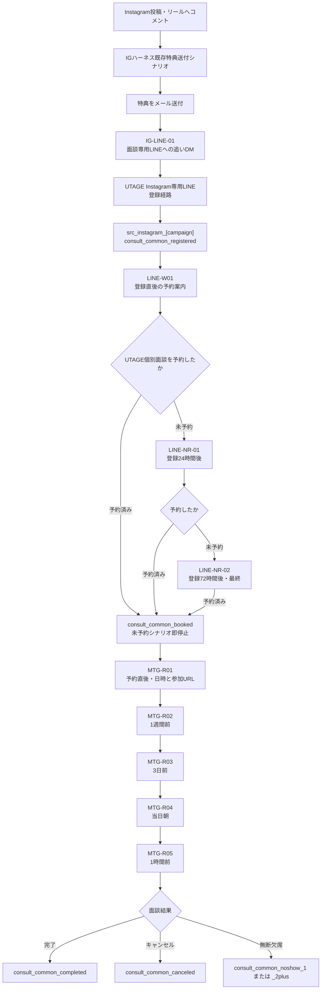

# IGハーネス × 面談専用LINE（UTAGE）実装指示書

## 1. 案件情報

- 案件名: Instagram特典送付後 → 面談専用LINE → 個別面談予約
- 目的: IGハーネスで特典送付後のInstagramユーザーを面談専用LINEへ案内し、UTAGEで予約・未予約フォロー・予約者リマインドを自動化する
- 流入元: Instagramのコメント・DMを起点としたIGハーネス既存シナリオ
- 中間CV: 面談専用LINE登録、予約カレンダー表示、面談予約
- 最終CV: 個別面談への参加
- 面談時間: 30分
- 予約時の必須項目: 名前、メールアドレス
- 開催方法: Zoomを第一候補とし、運用都合によりGoogle Meetも可
- ステータス: Spreadsheet承認済み・実装待ち
- 承認済みSpreadsheet: [インスタ追いDM後 のコピー](https://docs.google.com/spreadsheets/d/1q8Ch26-dT0S0NmVgku2gYvcYwjSvjDahLbSSfRLXmvg/edit?gid=1075291337#gid=1075291337)
- GitHub案件フォルダ: [instagram-ig-harness-consultation-line-handoff](https://github.com/puuku0510/suya-ai-school-line-funnel/tree/main/instagram-ig-harness-consultation-line-handoff)
- 承認日: 2026-07-30

## 2. この指示書の使い方

この指示書は、実装担当者本人が読むほか、Claude CodeやCodexへ渡して実装手順の案内を受けることを想定しています。

実装担当者またはAIは、最初に既存設定を確認してください。画面名や機能名が本書と異なる場合は、現行画面とUTAGE公式マニュアルを優先します。ただし、メッセージ本文、配信タイミング、CTA、ラベル設計、停止条件を独自に変更してはいけません。

本番変更前に、必ず次を提示してください。

1. 既存設定として見つかったもの
2. 新規作成するもの
3. 変更するもの
4. 触らないもの
5. 変更による影響範囲
6. テスト用アカウントとテスト手順

## 3. 全体フロー



## 4. 実装前に確定する実値

以下は推測で埋めず、既存管理画面または運用責任者から確認してください。

| 項目 | 本書の表記 | 実装時に確定する値 |
|---|---|---|
| Instagramアカウント | `[Instagramアカウント]` | 対象のプロアカウント |
| IGハーネスシナリオ | `[既存特典送付シナリオ]` | 現在特典を送っているシナリオ |
| キャンペーン識別子 | `[campaign]` | 投稿・特典を識別できる英数字 |
| 面談専用LINE | `[面談専用LINE]` | UTAGEへ接続するLINE公式アカウント |
| Instagram専用登録経路 | `[面談専用LINE_Instagram流入リンク]` | UTAGEで発行するLINE登録経路URL |
| 個別予約ページ | `[UTAGE個別予約URL]` | 個別相談・個別予約の申込URL |
| 面談日時 | `[面談日時]` | UTAGEイベント予約の置換文字 |
| 参加URL | `[参加URL]` | ZoomまたはMeet URLの置換文字 |
| 日程変更・キャンセルURL | `[日程変更・キャンセルURL]` | 現行UTAGE画面で利用できる置換文字または運用URL |
| 当日朝の送信時刻 | `当日朝` | 推奨9:00。運用責任者が最終決定 |

## 5. 作成・更新するもの

### IGハーネス

| 種別 | 名称 | 新規/更新 | 用途 |
|---|---|---|---|
| 既存シナリオ | `[既存特典送付シナリオ]` | 更新 | 特典送付後にIG-LINE-01を1回追加 |
| DMメッセージ | `IG-LINE-01` | 新規追加 | 面談専用LINEへ誘導 |
| ボタン | `面談専用LINEを追加する` | 新規追加 | Instagram専用登録経路URLを開く |

### UTAGE

| 種別 | 推奨名称 | 新規/更新 | 用途 |
|---|---|---|---|
| LINE配信アカウント | `面談専用LINE` | 既存確認または新規 | あらゆる面談流入で共用 |
| LINE登録経路 | `Instagram_[campaign]_面談` | 新規 | Instagram流入を識別 |
| ラベル群 | `consult_common_*`、`src_instagram_*` | 既存確認または新規 | 状態・流入元管理 |
| ステップ配信 | `面談共通_登録直後` | 新規 | LINE-W01 |
| ステップ配信 | `面談共通_未予約リマインド` | 新規 | LINE-NR-01、LINE-NR-02 |
| イベント・予約 | `面談共通_個別面談30分` | 新規 | 個別相談・個別予約 |
| リマインダ配信 | `面談共通_予約者リマインド` | イベント連携 | MTG-R01〜MTG-R05 |
| 計測リンク | `面談共通_予約カレンダー` | 新規 | カレンダークリックを記録 |
| Googleカレンダー連携 | 担当者アカウント | 既存確認または新規 | 空き時間抽出 |
| Zoom/Meet連携 | 担当者アカウント | 既存確認または新規 | 参加URL自動発行 |

## 6. ラベル辞書

UTAGEの画面上では「タグ」ではなく「ラベル」と呼びます。同名ラベルがある場合は重複作成せず、付与条件と利用中シナリオを確認してください。

| ラベル | 付与タイミング | 解除・終了 | 役割 |
|---|---|---|---|
| `src_instagram_[campaign]` | Instagram専用登録経路からLINE登録 | 原則維持 | 流入元の恒久記録 |
| `consult_common_registered` | 面談専用LINEへ登録 | 原則維持 | 共通面談LINE登録済み |
| `consult_common_offered` | LINE-W01送信時 | 面談完了時 | 予約案内済み |
| `consult_common_page_clicked` | 予約カレンダーCTAクリック | 原則維持 | カレンダー到達計測 |
| `consult_common_reminded_1` | LINE-NR-01送信後 | 面談予約時 | 未予約1回目送信済み |
| `consult_common_reminded_final` | LINE-NR-02送信後 | 面談予約時 | 未予約最終案内済み |
| `consult_common_booked` | 予約完了 | キャンセルまたは完了時 | 予約済み・予約者配信の条件 |
| `consult_common_canceled` | 予約キャンセル | 再予約時 | 旧予約リマインド停止 |
| `consult_common_completed` | 面談完了 | 原則維持 | 面談完了・再募集抑止 |
| `consult_common_noshow_1` | 初回無断欠席 | 再予約・完了時 | 初回無断欠席 |
| `consult_common_noshow_2plus` | 2回目以降の無断欠席 | 運用判断 | 自動再案内を行わない判断用 |
| `sales_won` | 成約時 | 原則維持 | 下位の集客配信を停止 |
| `sales_next_meeting` | 次回面談あり | 次回面談完了時 | 下位の面談募集を停止 |
| `sales_stop` | 営業停止希望 | 原則維持 | 営業・募集配信を停止 |

### 優先順位

1. `sales_won`、`sales_stop`
2. `sales_next_meeting`
3. `consult_common_booked`
4. `consult_common_completed`
5. `consult_common_offered`
6. 通常の教育・ナーチャリング

予約に紐づく日時・参加URLのリマインドはトランザクション配信です。予約が有効な限り送信し、キャンセルまたは面談完了で停止します。

## 7. IGハーネスの設定

### 7.1 既存シナリオの確認

1. `[Instagramアカウント]` とIGハーネスの接続状態を確認する。
2. 特典のコメントトリガー、DM、メールアドレス取得、メール送付の現在の流れを記録する。
3. `[既存特典送付シナリオ]` の最後に、同目的の面談案内がないか確認する。
4. 既存の特典送付、メール取得、メール送信は変更しない。

### 7.2 IG-LINE-01を追加

- 起点: 特典送付完了後
- 条件: 特典送付済み、かつIG-LINE-01未送信
- 回数: 同一ユーザーへ1回
- 形式: テキスト＋URLボタン
- ボタン文言: `面談専用LINEを追加する`
- ボタンURL: `[面談専用LINE_Instagram流入リンク]`
- 注意: IGハーネス側でLINE登録済みかどうかを推測しない。流入判定はUTAGEの登録経路とラベルで行う。

本文:

```text
特典のお受け取りは無事できましたでしょうか？✨

メールでお届けしていますが、まれに迷惑メールフォルダに入ってしまうこともあるので、念のためご確認ください📩

また、特典や動画をご覧いただく中で、

「自分の場合はどう活用すればいいんだろう？🤔」
「AIで収益化する流れを、もう少し具体的に知りたい」
「何から始めればいいか整理したい」

という方に向けて、30分の無料個別レクチャーをご用意しています☺️✨

僕自身、法人向けのAIコンサルや企業研修を行いながら、個人でもAIを活用して収益化してきました。

その経験をもとに、AIを収益につなげる具体的な流れもお伝えできればと思います💡

面談をご希望の方だけで大丈夫ですので、こちらから「面談専用LINE」を追加してください👇😊

[面談専用LINE_Instagram流入リンク]
```

### 7.3 IGハーネスのテスト

1. テスト投稿またはテストユーザーでコメントトリガーを発火する。
2. 特典送付まで既存動作が壊れていないことを確認する。
3. IG-LINE-01が1回だけ届くことを確認する。
4. ボタンがInstagram専用LINE登録経路を開くことを確認する。
5. 同じユーザーで再度トリガーしても追いDMが重複しないことを確認する。

IGハーネスのバージョンによって画面名が異なる可能性があります。存在しないメニュー名を推測せず、既存シナリオの実画面に合わせて設定してください。

## 8. UTAGEの設定

### 8.1 面談専用LINE

1. `メール・LINE配信` で面談専用LINEの配信アカウントを確認または作成する。
2. 既存のLINE公式アカウントを利用する場合、別ファネルの配信シナリオと競合しないか確認する。
3. この配信アカウントはInstagramだけでなく、セミナー、YouTube、X、その他面談にも共用する。
4. 流入元固有の文章は登録経路側で分け、予約後の共通リマインドへ合流させる。

### 8.2 Instagram専用LINE登録経路

1. LINE登録経路 `Instagram_[campaign]_面談` を作成する。
2. 登録時に `src_instagram_[campaign]` と `consult_common_registered` を付与する。
3. 登録直後に `面談共通_登録直後` を開始する。
4. 発行したURLを `[面談専用LINE_Instagram流入リンク]` としてIG-LINE-01のボタンへ設定する。
5. UTAGEではシナリオ遷移時に登録経路情報が引き継がれない場合があるため、流入元はラベルにも残す。

### 8.3 個別相談・個別予約イベント

1. `イベント・予約` から `個別相談・個別予約` を選ぶ。
2. 推奨イベント名を `面談共通_個別面談30分` とする。
3. 所要時間を30分にする。
4. 申込フォームの必須項目を名前、メールアドレスにする。
5. 担当者のGoogleカレンダーを連携し、既存予定を予約不可として扱う。
6. ZoomまたはGoogle Meetを連携し、予約ごとに参加URLを自動発行する。
7. 予約完了時に `consult_common_booked` を付与し、`consult_common_canceled` を解除する。
8. 予約完了時に `面談共通_未予約リマインド` から即時解除する。
9. 予約者を `面談共通_予約者リマインド` へ登録する。
10. 日程変更時は旧日時のリマインド登録を解除し、新日時で再登録されたことを確認する。
11. キャンセル時は `consult_common_booked` を解除し、`consult_common_canceled` を付与する。

### 8.4 予約カレンダーの計測リンク

1. `[UTAGE個別予約URL]` を開く計測リンク `面談共通_予約カレンダー` を作成する。
2. クリック時に `consult_common_page_clicked` を付与する。
3. LINE-W01、LINE-NR-01、LINE-NR-02のCTAへ同じ計測リンクを設定する。
4. `consult_common_page_clicked` は予約完了を意味しない。予約判定はイベント申込完了だけで行う。

## 9. LINEシナリオの実装

### LINE-W01: 登録直後

- シナリオ: `面談共通_登録直後`
- 配信: 友だち追加直後
- 形式: テキスト＋ボタン
- CTA: `面談の日程を確認する`
- CTA URL: `[UTAGE個別予約URL]` の計測リンク
- 送信時: `consult_common_offered` を付与
- 送信後: `面談共通_未予約リマインド` を開始
- 開始対象外: `consult_common_booked`、`consult_common_completed`

```text
[name]さん、面談専用LINEへのご登録ありがとうございます！😊✨

この個別面談は、AIの知識を増やすだけではなく、今の仕事・経験・得意なことにどう掛け合わせるかを一緒に整理する時間です🌱

「自分にはどんなAI活用が合うんだろう？🤔」
「収益化までの流れを整理したい💡」
「まず何から始めればいい？」

といったことも、今の状況を伺いながら一緒に整理していきます。

ご希望の方は、こちらから空いている日程をご確認ください👇☺️

[UTAGE個別予約URL]

予約完了後、面談日時と当日の参加リンクをすぐにお送りします。
```

### LINE-NR-01: 未予約24時間後

- シナリオ: `面談共通_未予約リマインド`
- 配信: LINE登録24時間後
- CTA: `無料で相談してみる`
- 必要: `consult_common_offered`
- 除外: `consult_common_booked`、`consult_common_completed`、`sales_won`、`sales_stop`
- 送信後: `consult_common_reminded_1`

```text
[name]さん、面談の日程はもう確認されましたか？👀

「まだ初心者の自分には早いかも…💦」
「相談内容がまとまっていない…」

という状態でも、まったく問題ありません。

AIに詳しくなくても、

・今の仕事や経験をどう活かせるか
・AIで何ができそうか
・収益化に向けて最初に何をするか

を一緒に整理していきます🌱

無理なご案内などはありませんので、必要であればお気軽にご活用ください👇

[UTAGE個別予約URL]
```

### LINE-NR-02: 未予約72時間後・最終

- シナリオ: `面談共通_未予約リマインド`
- 配信: LINE登録72時間後
- CTA: `空き枠を確認する`
- 必要: `consult_common_offered`
- 除外: `consult_common_booked`、`consult_common_completed`、`sales_won`、`sales_stop`
- 送信後: `consult_common_reminded_final`
- 以後: 未予約催促を送らない

```text
【個別面談についてのご連絡】

[name]さん、面談枠について最後にご案内です😊

ありがたいことにご相談が増えており、すぐにご案内できる枠が限られてきてしまいました💦🙏

もし今、最初の一歩を踏み出したいと思っているのであれば、今の状況を伺いながら、次にやるべき一歩を一緒に整理できればと思います✨

必要な方だけ、こちらから日程をご確認ください👇☺️

[UTAGE個別予約URL]

お見送りされる場合、返信やお手続きは不要です。
```

### MTG-R01: 予約直後

- 起点: イベント予約完了
- CTA: `参加URLを保存する`
- 付与: `consult_common_booked`
- 解除: `consult_common_canceled`、未予約シナリオ
- 注意: `[面談日時]` と `[参加URL]` はUTAGEのイベント予約で選択できる置換文字を使う

```text
[name]さん、個別面談のご予約ありがとうございます！😊✨

ご予約内容はこちらです👇

📅 日時：[面談日時]
💻 参加URL：[参加URL]

当日は、今の状況や気になっていることを伺いながら、AIの活用方法や収益化までの流れを一緒に整理していきます💡

事前準備は特に不要ですので、リラックスしてご参加ください🌱


お話しできるのを楽しみにしています！☺️
```

### MTG-R02: 1週間前

- 配信: 開催7日前
- CTA: `来週の参加URLを確認する`
- 必要: `consult_common_booked`
- 除外: `consult_common_canceled`、`consult_common_completed`
- 7日前を過ぎて予約された場合: スキップ

```text
[name]さん、いよいよ来週です📅✨

日時：[面談日時]
参加URL：[参加URL]

もし余裕があれば、

・今の仕事や活動で困っていること
・AIでやってみたいこと
・収益化について気になっていること

を少しだけ考えておくと、より濃い時間になります📝

もちろん、まだまとまっていなくても大丈夫です！
当日一緒に整理していきましょう☺️🌱
```

### MTG-R03: 3日前

- 配信: 開催3日前
- CTA: `参加URLを確認する`
- 必要: `consult_common_booked`
- 除外: `consult_common_canceled`、`consult_common_completed`
- 3日前を過ぎて予約された場合: スキップ

```text
[name]さん、面談日まであと3日です🌱

📅 日時：[面談日時]
💻 参加URL：[参加URL]

相談したいことがまだまとまっていなくても大丈夫です。
気になっていることを箇条書きで少しだけメモしておくと、当日よりスムーズに整理できます📝✨
```

### MTG-R04: 当日朝

- 配信: 当日朝。推奨9:00
- CTA: `本日の参加URLを開く`
- 必要: `consult_common_booked`
- 除外: `consult_common_canceled`、`consult_common_completed`
- 当日朝の配信後に予約された場合: MTG-R01だけを送り、本メッセージは重複送信しない

```text
[name]さん、本日はよろしくお願いいたします！🔔✨

📅 日時：[面談日時]
💻 参加URL：[参加URL]

開始時刻になりましたら、こちらのリンクからお入りください👇😊

[参加URL]

お話しできるのを楽しみにしています！🌱
```

### MTG-R05: 1時間前

- 配信: 開催1時間前
- CTA: `参加URLを確認する`
- 必要: `consult_common_booked`
- 除外: `consult_common_canceled`、`consult_common_completed`
- 開始1時間以内に予約された場合: MTG-R01だけを送り、本メッセージは重複送信しない

```text
[name]さん、1時間前のリマインドになります⏳✨

📅 日時：[面談日時]

お飲み物などをご用意いただいて、リラックスしてご参加ください☺️

開始時刻になりましたら、こちらからお入りいただけます👇

[参加URL]
```

## 10. 予約変更・キャンセル・面談結果

### 日程変更

1. UTAGEの個別相談・個別予約の標準の日程変更手順を使う。
2. 旧日時のリマインダ配信から解除されたことを確認する。
3. 新日時を基準にリマインダ配信へ再登録されたことを確認する。
4. テストでは旧日時と新日時の両方を確認し、二重送信がないことを証明する。

### キャンセル

1. `consult_common_booked` を解除する。
2. `consult_common_canceled` を付与する。
3. 予約者リマインドを停止する。
4. 自動で未予約催促へ戻さない。再案内する場合は運用責任者が判断する。

### 面談完了

1. `consult_common_booked` を解除する。
2. `consult_common_completed` を付与する。
3. 以後の予約者リマインドと同目的の面談募集を停止する。
4. 営業結果として `sales_won`、`sales_next_meeting`、`sales_no_next_meeting`、`sales_stop` のいずれかを記録する。

### 無断欠席

1. 初回は `consult_common_noshow_1` を付与する。
2. 2回目以降は `consult_common_noshow_2plus` を付与する。
3. 無断欠席者向けの自動メッセージは承認済みSpreadsheetにないため、本文を勝手に追加しない。

## 11. 実装順序

1. 既存のIGハーネス、UTAGE、LINE、Googleカレンダー、Zoom/Meet設定を棚卸しする。
2. ラベルの重複を確認し、必要分だけ作成する。
3. 面談専用LINEの配信アカウントを確認または接続する。
4. Instagram専用LINE登録経路を作り、流入元ラベルを設定する。
5. 個別相談・個別予約イベントを作成する。
6. GoogleカレンダーとZoom/Meetを連携する。
7. 予約完了、変更、キャンセル時のアクションを設定する。
8. LINE-W01を作成する。
9. LINE-NR-01、LINE-NR-02を同じ未予約シナリオに作成する。
10. MTG-R01〜MTG-R05をイベント連携のリマインダ配信へ作成する。
11. 予約カレンダーの計測リンクを作り、3つの未予約CTAへ設定する。
12. IGハーネスへIG-LINE-01を追加し、Instagram専用登録経路URLを設定する。
13. テスト用InstagramユーザーとLINEユーザーで全経路を検証する。
14. 本番公開後、実装日・担当者・設定名・テスト結果を本書へ追記する。

## 12. テストケース

| No. | テスト | 期待結果 |
|---|---|---|
| 1 | Instagramコメントから既存特典フローを実行 | 特典送付が従来どおり動く |
| 2 | IG-LINE-01の受信 | 1回だけ届き、承認済み本文と一致 |
| 3 | IGのCTAをタップ | Instagram専用LINE登録経路が開く |
| 4 | LINEを新規登録 | `src_instagram_[campaign]` と `consult_common_registered` が付く |
| 5 | 登録直後 | LINE-W01が届き、カレンダーを開ける |
| 6 | 24時間未予約 | LINE-NR-01だけが届く |
| 7 | 72時間未予約 | LINE-NR-02が届き、以後催促されない |
| 8 | LINE-NR-01前に予約 | 未予約リマインドが1通も届かない |
| 9 | LINE-NR-01後、LINE-NR-02前に予約 | LINE-NR-02が届かない |
| 10 | 予約完了 | `consult_common_booked` が付き、MTG-R01が即時に届く |
| 11 | 10日以上前に予約 | MTG-R02、R03、R04、R05が各時刻に1回届く |
| 12 | 5日前に予約 | MTG-R02をスキップし、R03以降だけ届く |
| 13 | 当日朝送信時刻後に予約 | MTG-R01だけが即時に届き、R04は重複しない |
| 14 | 開始1時間以内に予約 | MTG-R01だけが即時に届き、R05は重複しない |
| 15 | 日程変更 | 旧日時の配信が止まり、新日時を基準に配信される |
| 16 | キャンセル | 以後の予約者リマインドが届かない |
| 17 | 面談完了 | `consult_common_completed` が付き、以後の募集・リマインドが止まる |
| 18 | 成約済み・営業停止ユーザー | 未予約募集が届かない |
| 19 | CTA計測 | クリックで `consult_common_page_clicked` が付くが、予約済みにはならない |
| 20 | 文章照合 | Spreadsheet、CSV、実配信の改行・絵文字・CTAが一致 |

## 13. 実装者への禁止事項

- Spreadsheet承認済み本文を独自に書き換えない。
- IGハーネスからLINE登録済みかどうかを推測して分岐しない。
- カレンダーをクリックしただけで予約済みにしない。
- 予約完了後も未予約シナリオへ残さない。
- 参加URLを静的に貼り、別予約者へ使い回さない。
- 存在を確認していないUTAGE置換文字を本文へ直書きしない。
- 日程変更後に旧日時のリマインドを残さない。
- 無断欠席者向けなど、未承認のシナリオ文章を勝手に追加しない。
- テストを行わずに本番公開しない。

## 14. 公式参考資料

- [UTAGE: 登録経路機能（LINE）](https://help.utage-system.com/archives/6101)
- [UTAGE: 登録経路別にラベル付与する方法](https://help.utage-system.com/archives/9131)
- [UTAGE: 個別相談・個別予約](https://help.utage-system.com/archives/7279)
- [UTAGE: イベント申込者へのラベル自動付与](https://help.utage-system.com/archives/9842)
- [UTAGE: 機能の全体構成](https://help.utage-system.com/archives/25099)

## 15. 実装記録

実装後に必ず埋めてください。

- 実装日:
- 実装担当者:
- IGハーネス対象シナリオ:
- UTAGE配信アカウント:
- UTAGE登録経路:
- UTAGEイベント名:
- UTAGEステップ配信名:
- UTAGEリマインダ配信名:
- テスト用Instagramアカウント:
- テスト用LINEアカウント:
- 全20テスト結果:
- 未確認事項:
- 本番公開日時:
