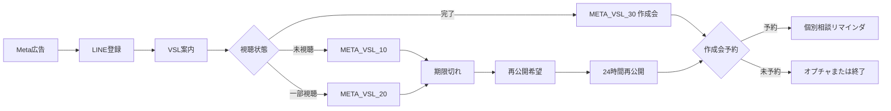

# Meta広告用LINEファネル UTAGE実装・監査指示書

## 1. 案件情報

- 流入元: Meta広告（Facebook / Instagram広告）
- 正しい入口: LINE登録直後からVSL
- 使用しないもの: 特典配布、Zoom活用サポート会、ライブセミナー
- 最終CV: `AIひとり起業スクール` 成約
- 中間CV: `AIひとり起業ロードマップ作成会` 予約
- UTAGE配信アカウント: `3TS1vbmqlbNx`
- 最終更新日: 2026-08-02

## 2. 正しい全体フロー

## 3. 実機のシナリオ

| シナリオ | ID | 配信 | 読者数（監査時） |
|---|---|---:|---:|
| `META_VSL_10_未視聴` | `E5mkccX7YYbv` | 25 | 30 |
| `META_VSL_20_一部視聴` | `rreS3iu3mwJM` | 17 | 9 |
| `META_VSL_30_視聴完了_作成会` | `GFLybO0hExQd` | 12 | 0 |
| `META_VSL_40_再公開希望` | `k2m48DZSB7KC` | 8 | 21 |
| `META_VSL_50_24時間再公開` | `a1gHcFv4AC8Z` | 7 | 3 |
| `AIでひとり起業個別相談リマインダ` | `CwPiD5bpWYMZ` | 13 | 1 |

全82配信は稼働中です。

## 4. 確認済みURL

- VSL: `https://utage-system.com/p/W8wW6ShW0iHd`（200）
- ロードマップ作成会: `https://utage-system.com/event/Nfqn55r0Vb3J/register`（200）

`https://utage-system.com/p/ud2vxiIdzVOc` はページ編集用ID由来のURLで、公開URLとしては404です。LINE本文へ使用しません。

## 5. 監査時に補修した停止条件

VSL配信65通を対象に条件を再設定し、即時配信1通を除く64通へ反映しました。

### 全VSL募集で除外

- `roadmap_booked`
- `roadmap_completed`
- `sales_in_progress`
- `sales_next_meeting`
- `sales_won`
- `sales_stop`

### 未視聴で追加除外

- `vsl_partial`
- `vsl_completed`

### 一部視聴で追加除外

- `vsl_completed`

`META_VSL_10_未視聴_No.01` は登録直後の即時配信で、UTAGE APIが条件追加を受け付けなかったため変更していません。登録直後の動画提供そのものなので、シナリオ入口側で成約・停止済み読者を登録しない設計にします。

## 6. 状態と優先順位

1. `sales_won` / `sales_stop`
2. `sales_next_meeting` / `sales_in_progress`
3. `roadmap_booked` / `roadmap_completed`
4. `vsl_reopened`
5. `vsl_completed`
6. `vsl_partial`
7. `vsl_unwatched`

上位状態が付いた時点で、下位シナリオから解除してください。メッセージ条件は二重防止であり、シナリオ解除の代わりではありません。

## 7. 必須アクション

### LINE登録直後

1. `src_meta_ads`
2. `line_main_registered`
3. `vsl_main_offered`
4. `vsl_unwatched`

を付与し、`META_VSL_10_未視聴` へ登録します。

### VSLページクリック

アクション `動画クリック_Meta`（`3Unj2dV0Qc39`）で、`vsl_page_clicked` と `vsl_partial` を付与し、`vsl_unwatched` を解除します。未視聴から外し、一部視聴へ登録します。

### VSL完了

アクション `視聴完了_Meta`（`MPJ66IvyAhb8`）で、`vsl_completed` を付与し、未視聴・一部視聴から解除して `META_VSL_30_視聴完了_作成会` へ登録します。

### 作成会予約

アクション `予約完了ラベル_Meta`（`8GfQ3CBKX6Mm`）で `roadmap_booked` を付与し、VSL5シナリオから解除します。予約者には `CwPiD5bpWYMZ` だけを残します。

## 8. 残っている漏れ

### 8.1 作成会欠席

欠席後専用シナリオは実機にありません。次を新設または運用で接続します。

- 初回欠席: `roadmap_noshow_1`、再予約案内
- 2回目以降: `roadmap_noshow_2plus`、再予約または `AIマニアの放課後`
- キャンセルは無断欠席回数に含めない

### 8.2 営業結果

面談後に必ず `sales_won`、`sales_next_meeting`、`sales_no_next_meeting`、`sales_stop` のいずれかを記録します。成約・停止・次回面談ありは全VSL募集から解除します。

### 8.3 表現の事実確認

現行本文には、次のような実績・希少性表現があります。

- `満員御礼`
- `残り枠が少なくなっています`
- `3ヶ月で100万円`
- 参加者の声・証言
- `再々受付の予定はない`

事実根拠を確認できないものは本番本文から外してください。監査ではユーザー承認なしに稼働中本文を変更していません。

## 9. 公開前テスト

1. Meta専用登録経路だけが `src_meta_ads` を付与する。
2. VSL未クリックは未視聴だけを受信する。
3. VSLクリック直後に未視聴が止まり、一部視聴へ移る。
4. 完了CTAで未視聴・一部視聴が止まり、作成会案内へ移る。
5. 予約直後にVSL5シナリオが止まり、予約リマインドだけになる。
6. 成約・営業停止・次回面談あり・商談中にはVSL募集が届かない。
7. VSLと作成会のURLが200で開く。
8. InstagramのセミナーURLやYouTubeの活用サポートURLが混ざっていない。
9. 欠席・キャンセル・再予約が正しいラベルへ分岐する。
10. 実績・残席・期限・証言に根拠がある。

## 10. 実装者への注意

- 対象アカウントは `3TS1vbmqlbNx` だけです。
- Instagram用 `66ET2JNrdHub` とYouTube用 `Y86og5tIw1hZ` を変更しません。
- 本番読者の一括登録・ラベル変更・削除は、対象人数を確認してから実施します。
- 変更後は、メッセージID、ステータス、条件、URL、読者数をUTAGEから再取得して記録します。
