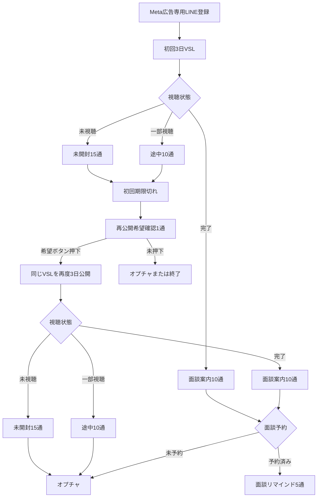
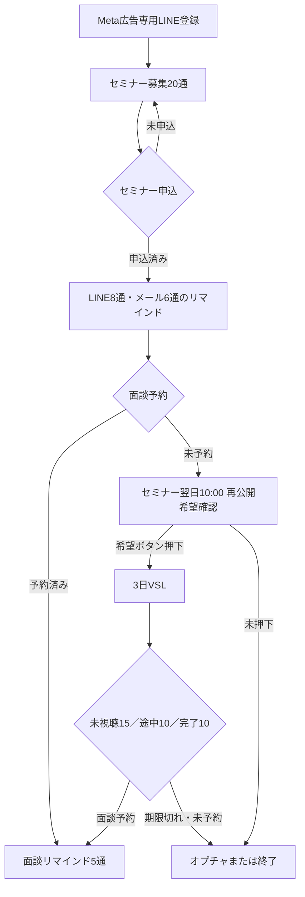
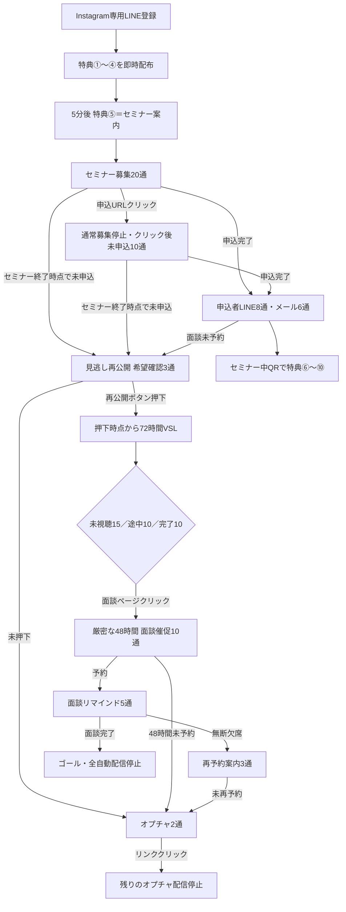

# 金子さん用｜3ファネル UTAGE実装指示書

## 1. 案件情報

- 案件名: VSL直行・Metaセミナー直行・Instagram 10大特典
- 目的: 媒体別の入口から、VSLまたはセミナーを経て `AIひとり起業ロードマップ作成会` へ誘導する
- 最終CV: `AIひとり起業スクール` 成約
- 実装担当者: 金子さん
- ステータス: Spreadsheet承認済み・UTAGE実装待ち
- Google Spreadsheet: https://docs.google.com/spreadsheets/d/1TGC-Jtf4z2IA1PpL8dK0oyHrh74d2uPkmfGCNQCnxus/edit
- GitHub案件フォルダ: https://github.com/puuku0510/suya-ai-school-line-funnel/tree/agent/audit-instagram-meta-funnels/kaneko-three-funnels-handoff
- 最終更新日: 2026-08-07
- 承認: 「スプシOK」（2026-08-05）／Instagramは吉本さん原案を優先し、YouTube本番UTAGEの読み取り監査と追加レビューを反映した123行へ再承認・同期（2026-08-07）
- 実装対象UTAGEアカウント: 実機監査で確定する。推測禁止
- 変更禁止UTAGEアカウント: YouTube `Y86og5tIw1hZ`

### 承認済み範囲

| ファネル | Spreadsheetタブ | アクション | メッセージ | 合計 |
|---|---|---:|---:|---:|
| Meta VSL直行 | `REVIEW_META_VSL直行_20260805` | 9 | 78 | 87 |
| Metaセミナー直行 | `REVIEW_METAセミナー直行_20260805` | 10 | 77 | 87 |
| Instagram 10大特典 | `REVIEW_Instagram10大特典_20260805` | 19 | 104 | 123 |
| 合計 |  | 38 | 259 | 297 |

本文全文、件名、CTA、画像URL、配信タイミング、行単位の付与・解除・除外条件は `kaneko-three-funnels-all-scenarios.csv` を参照する。本書はUTAGEの構造と実装順を定義し、CSVの本文を置き換えない。

## 2. 正本と変更禁止事項

### 正本の優先順位

1. Spreadsheet承認済み3タブ: 本文、絵文字、画像、CTA、配信時刻
2. Instagramの文章・絵文字・画像: 吉本さん原案Spreadsheetと `assets/instagram-yoshimoto/`
3. Metaセミナー直行の画像: `assets/meta-seminar-yoshimoto/` のDrive原本22枚
4. 本書: 状態、分岐、優先順位、停止条件、実装順、テスト
5. 全シナリオCSV: 承認済み297行の機械可読エクスポート
6. UTAGE本番: アカウント、オブジェクトID、イベント、URL、置換文字の実値

Instagramだけは、確定済みの状態遷移・配信時刻・停止条件を維持した上で、吉本さん原案の文章と絵文字を最優先する。原案に該当文がない行だけYouTube本文で補完し、実装者が新しい訴求文を独自作成してはいけない。

Instagramの特典①〜④は、専用LINE登録と同時配布の完了をもって受取済みとする。特典リンクのクリック有無は計測・分岐条件にせず、旧 BEN-C / BEN-N の「特典反応別」シナリオは実装・稼働させない。

### 絶対に変更しないもの

- YouTubeファネルのシナリオ、アクション、ラベル、イベント、ページ、文章、画像、CTA
- YouTube配信アカウント `Y86og5tIw1hZ`
- CSVの承認済み本文、件名、絵文字、画像、CTA、順番、配信時刻
- 別媒体の登録経路、ラベル、シナリオ、URLの流用
- Instagram本文を、吉本さん原案または指定済みYouTube補完文以外のオリジナル文章へ書き換えること
- `assets/instagram-yoshimoto/source-original/` の原本13枚、および `assets/meta-seminar-yoshimoto/source-original/` の原本22枚を再生成、リデザイン、文字変更すること

YouTubeは共通コピーの参照元であり、本案件の実装先ではない。本番変更前後にYouTubeアカウントの更新履歴または対象オブジェクトの変更なしを確認する。

YouTube本番UTAGEでは、申込者向けメール `REG-M04` からVSLを直接送る既存設定を確認している。ただし承認済みInstagramは「希望確認3通 → ボタン押下者だけ72時間VSL」を正本とする。この差分を理由にYouTubeまたは承認済みInstagramを独自変更しない。

## 3. 全体フロー

### 3.1 Meta広告 VSL直行

初手がVSLなので、このファネルだけVSLが最大2サイクルある。2回目は初回期限切れ後に再公開希望ボタンを押した人だけへ送る。同じVSLを使い、希望しない人へ再送しない。

### 3.2 Meta広告 セミナー直行

参加／欠席はVSL入口条件にしない。セミナー申込済みかつ面談未予約であれば、翌日10:00に再公開希望確認を送る。VSLは希望ボタン押下者のみ1サイクル。

### 3.3 Instagram 10大特典

短い案内動画は挟まない。特典⑤はセミナーへの直接申込案内。特典⑥〜⑩はセミナー中のQRで受け取らせ、LINEでは再配布しない。参加／欠席はVSL入口条件にしない。希望ボタン押下者だけ72時間VSLへ入れ、面談ページクリック後はVSL期限とオプチャ移行を止めて48時間催促を優先する。

## 4. UTAGEで作成・更新するもの

本番着手前に、各行を `新規`、`更新`、`変更なし` に分類する。既存名が一致してもID・用途・媒体が異なる場合は流用しない。

| 種別 | 名称・範囲 | 新規/更新 | 用途 |
|---|---|---|---|
| LINE登録経路 | Meta VSL直行専用 | 実機確認後決定 | `src_meta_ads` を確実に付与 |
| LINE登録経路 | Metaセミナー直行専用 | 実機確認後決定 | `src_meta_ads_seminar` を確実に付与 |
| LINE登録経路 | Instagram 10大特典専用 | 実機確認後決定 | `src_instagram_10benefits` を確実に付与 |
| ラベル | 本書5章およびCSV P/Q/R列 | 実機確認後決定 | 状態・除外・停止 |
| アクション | CSVの38アクション行 | 実機確認後決定 | 入口、クリック、完了、期限切れ、予約、営業結果 |
| 配信シナリオ | 本書6章 | 実機確認後決定 | 259メッセージ |
| イベント | `AIでひとり起業攻略法` | 実機確認後決定 | Metaセミナー、Instagram |
| 予約 | `AIひとり起業ロードマップ作成会` | 実機確認後決定 | 最終面談 |
| VSLページ | 3日間・読者起算 | 実機確認後決定 | 見逃し／直行VSL |
| 計測リンク | セミナー、VSL、面談、オプチャ | 実機確認後決定 | クリックアクション |
| 外部連携 | Zoom、メール、カレンダー | 実機確認後決定 | 開催・予約通知 |

### 実機確認時の候補アカウント

既存台帳にはMeta広告 `3TS1vbmqlbNx`、Instagram `66ET2JNrdHub` が記録されている。ただし今回の実装先と断定せず、アカウント名、LINE連携先、既存読者、既存シナリオを画面で照合してから採用する。

## 5. ラベル辞書と優先順位

### 5.1 共通の優先順位

1. `sales_won` / `sales_stop`
2. `sales_next_meeting` / `sales_in_progress`
3. `roadmap_booked`
4. `seminar_main_registered`（セミナー型のみ）
5. `vsl_*_completed`
6. `vsl_*_partial` または `vsl_main_started`
7. `vsl_*_unwatched` または `vsl_main_offered`
8. 再公開希望確認
9. セミナー募集
10. オプチャ・長期育成

上位状態の付与時は、条件除外だけに頼らず、競合する下位シナリオから読者を解除する。

### 5.2 共有ラベル

| ラベル | 付与条件 | 主な解除・停止 |
|---|---|---|
| `line_main_registered` | 対象LINE登録 | 原則保持 |
| `roadmap_booked` / `roadmap_meta_booked` | 面談予約完了 | 全セミナー・VSL・オプチャ募集を停止 |
| `sales_in_progress` | 商談開始 | 全下位営業募集を停止 |
| `sales_next_meeting` | 次回面談あり | 全下位営業募集を停止 |
| `sales_no_next_meeting` | 次回面談なし | 次の営業方針を人間が決定 |
| `sales_won` | 成約 | 全集客ファネルを完全停止 |
| `sales_stop` | 営業停止希望 | 全営業・集客配信を停止 |
| `openchat_invited` | オプチャ移行 | VSL募集から解除 |

### 5.3 Meta VSL直行専用

| ラベル | 付与条件 | 解除条件 |
|---|---|---|
| `src_meta_ads` | 専用登録経路 | 原則保持 |
| `vsl_meta_offered` | 初回VSL提示 | 原則保持 |
| `vsl_meta_unwatched` | VSL提示時 | クリック、完了、期限切れ、面談予約 |
| `vsl_meta_partial` | VSLクリック | 完了、期限切れ、面談予約 |
| `vsl_meta_completed` | 完了地点 | 面談予約時に下位募集停止 |
| `vsl_meta_expired` | 初回3日終了 | 再公開開始 |
| `vsl_meta_reopen_requested` | 再公開希望クリック | 原則保持 |
| `vsl_meta_reopened` | 2回目VSL開始 | 2回目終了または面談予約 |
| `roadmap_meta_page_clicked` | 面談ページクリック | 予約完了まで保持 |

### 5.4 セミナー型共通

| ラベル | 付与条件 | 解除条件 |
|---|---|---|
| `seminar_main_offered` | セミナー募集開始 | セミナー申込 |
| `seminar_main_registered` | 申込フォーム完了 | 原則保持 |
| `vsl_replay_requested` | 再公開希望クリック | 原則保持 |
| `vsl_main_offered` | 希望者へ3日VSL提示 | 期限切れまたは面談予約 |
| `vsl_main_started` | VSLページクリック | 完了、期限切れ、面談予約 |
| `vsl_main_completed` | VSL完了地点 | 面談予約時に下位募集停止 |
| `vsl_main_expired` | 3日終了 | オプチャ移行 |

MetaセミナーとInstagramを同一UTAGEアカウントへ実装する場合、媒体間で共有ラベルが衝突する。実装前に媒体別接頭辞へ分離する設計変更を提示し、承認を得る。別アカウントならCSVの名称をそのまま使用できる。

### 5.5 Instagram専用

| ラベル | 付与条件 | 解除条件 |
|---|---|---|
| `src_instagram_10benefits` | Instagram専用登録 | 原則保持 |
| `ig_benefit_1to4_delivered` | 専用LINE登録直後の特典①〜④配布完了。この時点で受取済み扱い | 原則保持 |

`ig_benefit_1to4_delivered` の付与に、特典リンクのクリックを要求しない。クリック状態用ラベル・アクション・分岐、および旧 BEN-C / BEN-N シナリオは作らない。特典⑥〜⑩のLINE配布ラベル・シナリオも作らない。

## 6. シナリオ実装

本文の実装値はCSVの同一 `ファネル`・`No.` 行を使う。既存の管理IDはYouTube参照元IDを含むため、新規UTAGEオブジェクトIDとして入力しない。新規作成後の実IDを実装記録へ追記する。

### 6.1 Meta VSL直行（78メッセージ）

| シナリオ | CSV No. | 通数 | 起点 |
|---|---:|---:|---|
| `META_VSL_10_VSL_未開封` | 10–24 | 15 | 初回VSL提示 |
| `META_VSL_10_VSL_一部視聴` | 25–34 | 10 | 初回VSLクリック |
| `META_VSL_10_VSL_視聴完了` | 35–44 | 10 | 初回VSL完了 |
| `META_VSL_40_再公開希望確認` | 45 | 1 | 初回VSL終了翌日12:00 |
| `META_VSL_50_VSL_未開封` | 46–60 | 15 | 再公開希望クリック |
| `META_VSL_50_VSL_一部視聴` | 61–70 | 10 | 再公開VSLクリック |
| `META_VSL_50_VSL_視聴完了` | 71–80 | 10 | 再公開VSL完了 |
| `META_VSL_80_05 面談予約リマインド（vVq新規）` | 81–85 | 5 | 面談予約完了 |
| `META_VSL_90_オプチャ_初回参加案内` | 86–87 | 2 | 未転換終了 |

必須アクション9行はCSV No.1–9。初回と再公開のVSL本文は同一だが、別シナリオとして状態と期限を分ける。

### 6.2 Metaセミナー直行（77メッセージ）

| シナリオ | CSV No. | 通数 | 起点 |
|---|---:|---:|---|
| `META_SEM_10_セミナー募集_未申込者` | 11–30 | 20 | 専用LINE登録 |
| `META_SEM_20_09 申込者LINE（k6x新規）` | 31–38 | 8 | セミナー申込完了 |
| `META_SEM_20_10 申込者メール（k6x新規）` | 39–44 | 6 | セミナー申込完了・メールあり |
| `META_SEM_30_再公開希望確認` | 45 | 1 | 申込済み・面談未予約、翌日10:00 |
| `META_SEM_40_VSL_未開封` | 46–60 | 15 | 再公開希望クリック |
| `META_SEM_40_VSL_一部視聴` | 61–70 | 10 | VSLクリック |
| `META_SEM_40_VSL_視聴完了` | 71–80 | 10 | VSL完了 |
| `META_SEM_80_05 面談予約リマインド（vVq新規）` | 81–85 | 5 | 面談予約完了 |
| `META_SEM_90_オプチャ_初回参加案内` | 86–87 | 2 | 未転換終了 |

必須アクション10行はCSV No.1–10。参加者／欠席者ラベルによる分岐は作らない。

### 6.3 Instagram 10大特典（19アクション・104メッセージ）

#### 本文の出典ルール

- 各行の出典は承認済みSpreadsheetとCSVの記録を正本とする
- 吉本さん原案を最優先し、原案に必要な通数がない行だけYouTube承認済み本文で補完する
- 調整してよいもの: `%line_name%`、イベント・Zoom・VSL・面談・オプチャの変数、確定済み5分送信、セミナー中QR、再公開希望者だけVSLという技術的整合
- 調整してはいけないもの: 訴求、語調、絵文字、感情表現の独自リライト
- `100名以上`、`満席`、感想・申込数などの実績表現は、UTAGE公開前に根拠を確認する。根拠がなければ該当文だけ削除し、新しい実績表現は作らない

#### 画像の出典ルール

吉本さんのDrive原本画像フォルダから回収した全35枚を正本とする。Instagram 13枚は `assets/instagram-yoshimoto/source-original/`、Metaセミナー直行22枚は `assets/meta-seminar-yoshimoto/source-original/` に格納している。本文行との対応は各READMEを参照し、SpreadsheetのU/V/X/Y列およびUTAGEの対応行へすべて設定する。`6641105e-3faa-4150-9a5f-6c64d87ba6dd.png` は画像内では「セミナー参加者様へ」となっているが、これを理由に参加／欠席分岐を新設してはいけない。

| シナリオ | CSV No. | 通数 | 起点 |
|---|---:|---:|---|
| `IG_00_入口・特典` | 20–21 | 2 | 新規LINE登録、特典①〜④、5分後の特典⑤ |
| `IG_10_セミナー募集` | 22–41 | 20 | セミナー未申込 |
| `IG_11_セミナーページクリック後未申込` | 42–51 | 10 | 申込URLクリック・申込未完了 |
| `IG_20_申込者LINE` | 52–59 | 8 | セミナー申込完了 |
| `IG_21_申込者メール` | 60–65 | 6 | セミナー申込完了・メールあり |
| `IG_30_再公開希望確認` | 66–68 | 3 | セミナー終了後・面談未予約 |
| `IG_40_VSL_未視聴` | 69–83 | 15 | 再公開ボタン押下 |
| `IG_41_VSL_途中` | 84–93 | 10 | VSL視聴開始 |
| `IG_42_VSL_完了・面談案内` | 94–103 | 10 | VSL完了 |
| `IG_50_面談クリック後48時間催促` | 104–113 | 10 | 面談ページクリック |
| `IG_60_面談予約リマインド` | 114–118 | 5 | 面談予約完了 |
| `IG_70_面談無断欠席・再予約` | 119–121 | 3 | 無断欠席 |
| `IG_90_オプチャ` | 122–123 | 2 | 未転換終了 |

必須アクション19行はCSV No.1–19。No.20の特典①〜④配布完了を受取済みの入口とし、実クリックを判定しない。No.20とNo.21の間は必ず5分。旧BEN-C／BEN-N、短い動画、特典⑥〜⑩のLINE配信を追加しない。

## 7. イベント・予約設定

### セミナー `AIでひとり起業攻略法`

- 対象: Metaセミナー直行、Instagram
- 申込項目: 名前、メールアドレス
- 開催: Zoom
- 申込完了: `seminar_main_registered` 付与、未申込募集停止、LINE8通へ登録、メール取得時のみメール6通へ登録
- 未申込募集: 7日前10:00・20:00と3日前10:00・20:00を含み、申込完了で即停止
- 申込者リマインド: 7日前・3日前はLINEとメールの2接点。申込時点ですでに過ぎた時刻は送らない
- 開始10分前: 固定の登録経過時刻ではなく、必ずイベント相対の10分前に設定
- 参加／欠席: VSL入口条件に使用しない
- セミナー終了後: Instagramは未申込者と申込済み・面談未予約者へ再公開希望確認3通。参加／欠席は条件にしない
- 再公開ボタン押下: Instagramは押下時点から72時間VSL。未押下者へVSLを送らない
- 面談予約済み: 再公開希望確認を送らず面談リマインドのみ

### `AIひとり起業ロードマップ作成会`

- 予約方式: UTAGEイベント・予約
- 所要時間: 30分
- 受付項目: 名前、メールアドレス
- 開催: Zoom
- Googleカレンダー連携: 実機で確認
- 予約完了: `roadmap_booked` または `roadmap_meta_booked` を付与し、全競合募集を停止
- 日程変更: 旧日程リマインドを停止し、新日程基準で再登録
- キャンセル: 予約者リマインドを停止。再募集可否は運用担当へ確認
- 予約者リマインド除外: キャンセル済み、日程変更済みの旧予約、成約、営業停止。`roadmap_booked` 自体は除外しない
- Instagramの面談ページクリック: VSL完了向け、期限配信、オプチャ移行を止め、クリック時点から厳密な48時間の催促10通へ登録
- Instagramの無断欠席: 再予約案内3通を送り、未再予約ならオプチャ2通へ移す
- 面談完了: ゴールとして全自動配信を停止し、営業結果を必ず記録

## 8. 変数・URL辞書

| 変数 | 意味 | UTAGEでの取得元 | 確認状態 |
|---|---|---|---|
| `[name]` | 読者名 | LINE/読者置換文字 | 実機確認 |
| `[開催日時]` | セミナー開催日時 | イベント置換文字 | 実機確認 |
| `[セミナー申込URL]` | セミナー申込ページ | 対象イベント公開URL | 未確定 |
| `[ZoomURL]` | セミナー参加URL | イベント参加URL置換文字 | 未確定 |
| `[VSLURL]` | 読者別3日VSL | 計測リンク付き公開URL | 未確定 |
| `[VSL終了日時]` | 読者別公開期限 | VSL登録起算値 | 実機確認 |
| `[VSL開始日時]` | 再公開ボタン押下日時 | クリックアクション | 実機確認 |
| `[ロードマップ作成会URL]` | 面談予約ページ | 対象予約枠公開URL | 未確定 |
| `[面談受付終了日時]` | 面談ページクリックから48時間後 | クリックアクション起算 | 実機確認 |
| `[予約日時]` | 予約済み面談日時 | 予約置換文字 | 実機確認 |
| `[面談ZoomURL]` | 予約者個別Zoom | 予約イベント置換文字 | 実機確認 |
| `[オプチャURL]` | AIマニアの放課後 | 運用担当確認 | 未確定 |
| `[再公開希望アクション]` | 希望ボタン押下アクション | 媒体別UTAGEアクション | 未確定 |
| `[セミナー名]` | メール件名用のセミナー名 | `AIでひとり起業攻略法` またはイベント置換文字 | 実機確認 |
| `%line_name%` | LINE登録名 | UTAGE読者置換文字 | 実機確認 |
| `%event_schedule%` | セミナー／面談の予約日時 | UTAGEイベント置換文字 | 実機確認 |
| `%event_info%` | 面談の参加情報・Zoom URL | UTAGEイベント置換文字 | 実機確認 |
| `%cancel%` | メール配信停止URL | UTAGEメール置換文字 | 実機確認 |

固定URLへ置き換える前に、媒体とイベントを照合する。セミナー日時、Zoom、面談日時は可能な限りUTAGEのイベント・予約置換文字を使い、開催回変更時の誤送信を防ぐ。

## 9. 実装順序

1. 対象3アカウントまたは登録経路を特定し、YouTube `Y86og5tIw1hZ` を除外する。
2. 既存ラベル、アクション、シナリオ、イベント、ページ、予約枠、計測リンクをエクスポートする。
3. CSV297行を既存オブジェクトと照合し、`新規`、`更新`、`変更なし` を決める。
4. 未確定のID・URL・置換文字・開催日時を一覧化し、人間の承認を得る。
5. 媒体別ラベルを作成し、上位状態の停止アクションから実装する。
6. LINE登録経路と流入ラベルを作る。
7. セミナーイベント、面談予約、VSLページ、Zoom、メール連携を設定する。
8. 38アクションを依存順に作る。予約・成約・営業停止の停止処理を先に完成させる。
9. 259メッセージをCSV順に下書きで作る。
10. 画像、CTA、計測リンク、置換文字、期限を行単位で照合する。Instagram原本13枚とMetaセミナー直行原本22枚が各README対応表どおり全件設定されていることを確認する。
11. テストユーザーで全経路を実行する。
12. テスト合格後に公開し、UTAGEから再取得して件数と条件を照合する。
13. 実装日、担当者、実ID、変更内容、テスト結果を本書へ追記する。

## 10. テストケース

### 共通

1. 専用登録経路だけが正しい媒体ラベルを付与する。
2. 別媒体の読者が対象シナリオへ入らない。
3. 予約直後に未予約向けセミナー・VSL・オプチャ配信が停止する。
4. `sales_in_progress`、`sales_next_meeting`、`sales_won`、`sales_stop` で下位配信が止まる。
5. 日程変更後は旧日程リマインドが止まり、新日程基準で届く。
6. キャンセル、無断欠席、面談完了後の状態が重複しない。
7. 全URL、計測アクション、置換文字、画像、送信者 `すや` を実機確認する。
8. CSVの38アクション、259メッセージ、合計297行と実装件数が一致する。
9. 「多くの感想」を含む4行は、公開前に根拠を確認する。未確認なら該当文のみ削除または事実ベースへ置換し、変更承認を得る。
10. YouTubeアカウント `Y86og5tIw1hZ` に本案件由来の更新がない。

### Instagram

1. 専用LINE登録直後に特典①〜④が配布され、同時に `ig_benefit_1to4_delivered` が付く。
2. 特典リンクを開いても開かなくても、登録5分後に同じ特典⑤＝セミナー案内へ進む。
3. 特典リンクのクリック用ラベル・アクション・分岐がなく、旧 BEN-C / BEN-N シナリオが稼働していない。

### Meta VSL直行

1. 登録直後に初回VSLへ入る。
2. 未視聴→クリックで未開封が止まり、一部視聴へ移る。
3. 完了地点で未開封・一部視聴が止まり、面談案内へ移る。
4. 初回3日終了後に再公開希望確認が1回だけ届く。
5. 希望ボタン未押下者へ2回目VSLが届かない。
6. 希望ボタン押下者だけ同じVSLを再度3日視聴できる。
7. 2回目終了後はVSLを3回目送らず、オプチャまたは終了へ進む。

### Metaセミナー直行

1. 登録後に短い案内動画を挟まず、セミナー募集へ進む。
2. 申込完了で未申込20通が止まり、LINE8通・メール6通へ移る。
3. 面談予約済みには翌日10:00の再公開希望確認が届かない。
4. 面談未予約には翌日10:00に再公開希望確認が届く。
5. 参加／欠席状態に関係なく、希望ボタン押下者だけVSLへ入る。
6. ボタン未押下者へVSLが届かない。
7. VSLは1サイクルだけで、終了後はオプチャまたは終了へ進む。
8. 未申込者には7日前10:00・20:00と3日前10:00・20:00の各2通が届き、申込済みには7日前・3日前ともLINEとメールの2接点がある。
9. 開始10分前の募集案内がイベント開始後に届かない。
10. 面談予約済みのテストユーザーへ予約完了・前日・当日・3時間前・30分前の5通が届き、キャンセルまたは日程変更後の旧予約では止まる。

### Instagram

1. 登録直後に特典①〜④が届く。
2. 5分後に特典⑤としてセミナー申込案内が届く。
3. 特典リンクを開かなくても同じ流れになり、旧BEN-C／BEN-Nへ入らない。
4. 特典①〜⑤の間に短い動画が挟まらず、特典⑥〜⑩がLINEから送られない。
5. セミナー中のQRから特典⑥〜⑩を受け取れる。
6. セミナーURLクリックで通常募集20通が止まり、申込完了とは判定されず、クリック後未申込10通へ移る。
7. 申込完了で未申込系がすべて止まり、LINE8通・メール6通へ移る。
8. 7日前・3日前を含む相対配信が過去分を遡及送信しない。
9. セミナー終了後、未申込者と申込済み・面談未予約者へ希望確認が正確に3通届く。
10. 参加／欠席に関係なく、希望ボタン押下者だけ押下時点から72時間VSLへ入る。
11. VSL開始で未視聴15通、VSL完了で未視聴・途中10通が止まり、完了後面談案内10通へ移る。
12. 面談ページクリックでVSL期限とオプチャ移行が止まり、クリック時点から厳密な48時間の面談催促10通へ入る。
13. 48時間内の面談予約で催促が止まり、予約後リマインド5通だけが届く。
14. 面談無断欠席時は再予約案内3通、その後未再予約ならオプチャ2通へ移る。
15. 面談完了者へオプチャを含む自動配信が届かず、オプチャリンククリックで残りの案内が止まる。
16. 19アクション・104メッセージ・合計123行がSpreadsheet、CSV、UTAGEで一致する。
17. 吉本さん原案を最優先した本文・絵文字がCSVと一致し、新規オリジナル文がない。
18. Drive原本画像35枚（Instagram 13枚＋Metaセミナー直行22枚）が全件存在し、対応行とUTAGEから確認できる。
19. 開始10分前の募集案内がイベント開始後に届かない。
20. YouTube本番の更新履歴に本案件由来の変更がない。

## 11. 実装者への注意

- 本番ID、URL、置換文字、対象人数を推測しない。
- 既存設定を確認し、重複ラベル・重複シナリオ・二重登録を避ける。
- 本番読者の一括登録やラベル一括変更の前に、対象人数と復旧方法を提示する。
- 既存稼働中シナリオを直接上書きせず、下書き複製または差分バックアップを取る。
- 承認済み本文の修正が必要なら、理由、対象CSV行、修正文を提示し、再承認を得る。
- 実装後はUTAGEから対象オブジェクトを再取得し、自己申告ではなく実値で検証する。
- 変更履歴に実装日、実装者、対象アカウント、変更前後、テスト結果、未解決事項を追記する。

## 12. 実装記録

| 項目 | 記録 |
|---|---|
| 実装日 | 未実装 |
| 実装者 | 金子さん |
| 対象アカウント | 未確定 |
| コミット | 未確定 |
| テスト結果 | 未実施 |
| 未解決事項 | 対象アカウント、全実URL、置換文字、開催日時、「多くの感想」の根拠 |

